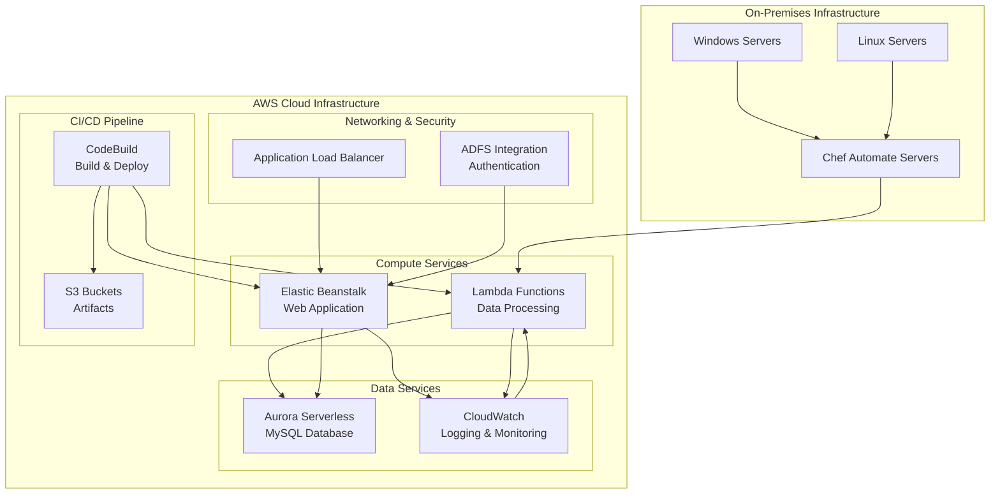
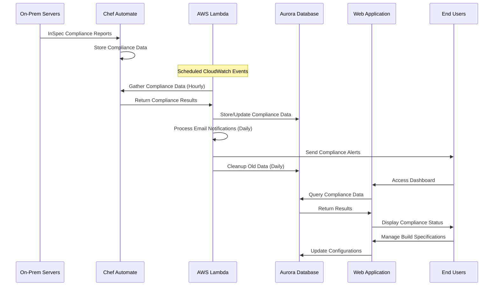
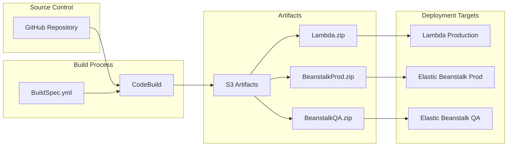

# Asset Compliance Tracker (ACT) - Architecture Documentation

## Overview

Asset Compliance Tracker (ACT) is a hybrid on-premises/cloud PCI compliance monitoring solution designed to monitor virtual machines and physical servers. The system provides automated compliance checking, reporting, and management capabilities for organizations maintaining PCI DSS compliance.

## System Architecture

ACT consists of four main .NET Core 8.0 components working together to provide comprehensive compliance monitoring:

### Core Components

1. **act.core.data** - Entity Framework data layer with MySQL database support
2. **act.core.etl** - Extract, Transform, Load operations for compliance data
3. **act.core.web** - ASP.NET Core MVC web application for user interface
4. **act.core.etl.lambda** - AWS Lambda functions for automated data processing

### Technology Stack

- **.NET Core 8.0** - Primary application framework
- **Entity Framework Core** - ORM with MySQL support via Pomelo provider
- **MySQL** - Primary database (AWS Aurora Serverless in production)
- **Chef InSpec** - Compliance testing framework
- **Docker** - Containerization for deployment
- **AWS Services** - Lambda, Elastic Beanstalk, Aurora Serverless, CloudWatch

## AWS Deployment Architecture

## Data Flow Architecture

## AWS Services Configuration

### Lambda Functions

The system uses a single Lambda function with multiple execution modes triggered by CloudWatch Events:

| Function | Schedule | Purpose |
|----------|----------|---------|
| `databaseupdate` | On-demand | Apply Entity Framework migrations |
| `gather` | Hourly | Collect data from Chef Automate servers |
| `email` | Daily | Send compliance notification emails |
| `reset` | Hourly | Reset status for non-reporting nodes (48+ hours) |
| `purgedetails` | Daily | Clean up old compliance details |
| `purgeruns` | Daily | Remove compliance runs older than 28 days |
| `purgeinactive` | Configurable | Remove deactivated nodes (7+ days old) |

### Elastic Beanstalk Configuration

- **Platform**: Docker running .NET Core 8.0
- **Load Balancer**: Application Load Balancer with HTTPS
- **Auto Scaling**: Configurable based on demand
- **Health Monitoring**: Integrated with CloudWatch
- **Deployment**: Blue/green deployments via CodeBuild

### Aurora Serverless Database

- **Engine**: MySQL 8.0 compatible
- **Scaling**: Automatic based on demand
- **Backup**: Automated daily backups
- **Security**: VPC isolation, encryption at rest
- **Monitoring**: CloudWatch metrics and logs

### CloudWatch Integration

- **Application Logs**: Structured logging from web application and Lambda
- **Metrics**: Custom metrics for compliance status and system health
- **Alarms**: Automated alerting for system issues
- **Events**: Scheduled triggers for Lambda functions

## CI/CD Pipeline

### Build Process

The CodeBuild process follows these steps:

1. **Pre-build**: Create staging directories and copy configuration files
2. **Build**: Restore dependencies, compile, and publish .NET applications
3. **Post-build**: Package applications into deployment-ready ZIP files
4. **Artifacts**: Upload Lambda and Elastic Beanstalk packages to S3

## Database Schema

The system uses Entity Framework Core with a MySQL database containing the following main entities:

### Core Entities

- **Nodes**: Represents servers/VMs being monitored
- **BuildSpecifications**: Defines expected configurations for different server types
- **ComplianceResults**: Stores compliance test results and status
- **Environments**: Chef Automate server configurations
- **Employees**: User management and ownership tracking

### Compliance Entities

- **ComplianceResultTests**: Individual test results
- **ComplianceResultErrors**: Error details for failed tests
- **SoftwareComponents**: Expected software installations
- **Ports**: Expected open network ports
- **Justifications**: Explanations for compliance exceptions

### Reference Data

- **Products**: Product codes for server categorization
- **Functions**: Server functional roles
- **PCI Scope Classifications**: A (most secure), B (more secure), C (least secure)
- **Platform Types**: Linux, Windows Server, Unix, Windows Client, Appliance, Other

## Chef InSpec Integration

### Compliance Profiles

The system includes two main InSpec compliance profiles:

1. **csg_linux_compliant_server** (v2.2.0)
   - Supports: CentOS, RHEL, RedHat
   - Tests: Package installations, open ports, system configurations

2. **csg_windows_compliant_server** (v2.2.0)
   - Supports: Windows Server and Client systems
   - Tests: Windows features, installed software, network ports

### Chef Cookbook

The ACT cookbook (`Chef/cookbooks/act/`) provides:

- REST API integration with ACT web application
- Attribute management for InSpec tests
- Automated compliance test execution
- Result reporting back to Chef Automate

## Security Architecture

### Authentication & Authorization

- **ADFS Integration**: Federated authentication via WS-Federation
- **Claims-based Security**: User identity and role management
- **SSL/TLS**: HTTPS enforcement for all web traffic

### Data Protection

- **Database Encryption**: Aurora Serverless encryption at rest
- **Transit Encryption**: TLS for all API communications
- **VPC Isolation**: Network-level security in AWS
- **IAM Roles**: Least-privilege access for AWS services

### Compliance Features

- **PCI Scope Management**: Automatic classification of servers
- **Audit Trails**: Complete history of compliance status changes
- **Exception Management**: Justification tracking for non-compliant items
- **Automated Reporting**: Regular compliance status notifications

## Monitoring & Observability

### Application Monitoring

- **CloudWatch Logs**: Centralized logging for all components
- **Custom Metrics**: Compliance status, node counts, test results
- **Health Checks**: Automated system health monitoring
- **Performance Metrics**: Response times, error rates, throughput

### Alerting

- **Compliance Alerts**: Notifications for failing nodes
- **System Alerts**: Infrastructure and application issues
- **Email Notifications**: Automated reports to stakeholders
- **Dashboard Views**: Real-time compliance status visualization

## Scalability & Performance

### Horizontal Scaling

- **Elastic Beanstalk**: Auto-scaling web application instances
- **Aurora Serverless**: Automatic database scaling
- **Lambda**: Serverless scaling for background processing

### Performance Optimization

- **Database Indexing**: Optimized queries for large datasets
- **Caching**: Application-level caching for frequently accessed data
- **Asynchronous Processing**: Background jobs for data gathering and cleanup

## Disaster Recovery

### Backup Strategy

- **Database Backups**: Automated Aurora Serverless backups
- **Code Repository**: Git-based source control with GitHub
- **Configuration Management**: Infrastructure as Code practices

### High Availability

- **Multi-AZ Deployment**: Database and application redundancy
- **Load Balancing**: Traffic distribution across multiple instances
- **Health Monitoring**: Automatic failover for unhealthy instances
