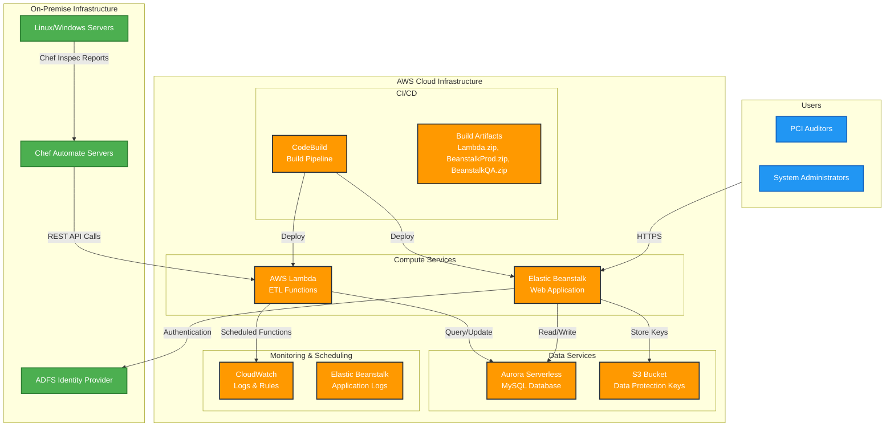
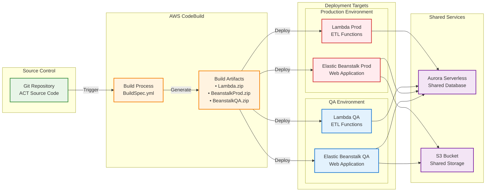
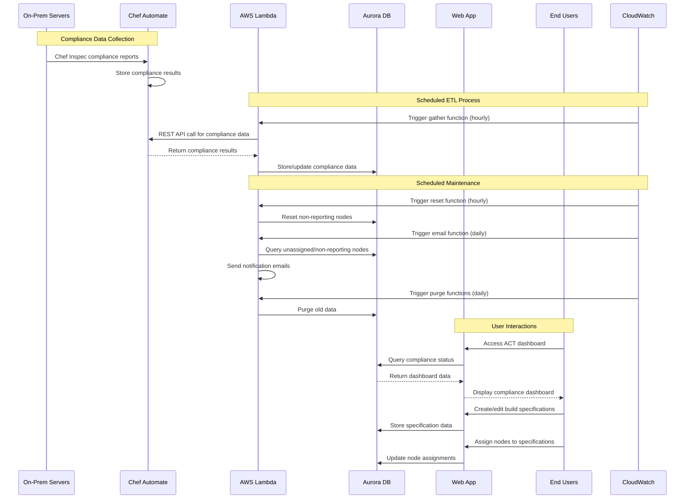
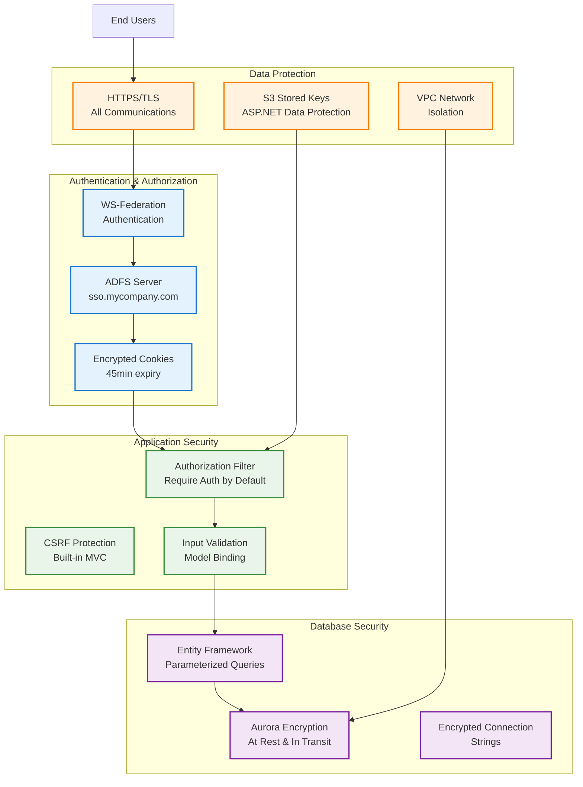

# ACT (Asset Compliance Tracker) - AWS Architecture Diagrams

## High-Level Architecture Overview



## Detailed Component Architecture

```mermaid
graph TB
    subgraph "Web Tier - Elastic Beanstalk"
        subgraph "ACT Web Application"
            MVC[.NET 8 MVC<br/>act.core.web]
            Auth[WS-Federation Auth<br/>ADFS Integration]
            DataProt[Data Protection<br/>Keys in S3]
        end
    end

    subgraph "Application Tier - AWS Lambda"
        subgraph "ETL Lambda Functions"
            LambdaCore[.NET 8<br/>act.core.etl.lambda]
            Functions[
                • databaseupdate<br/>
                • gather (by environment)<br/>
                • email notifications<br/>
                • reset compliance<br/>
                • purge operations
            ]
        end
    end

    subgraph "Data Tier"
        subgraph "Aurora Serverless MySQL"
            DB[(ACT Database)]
            Tables[
                • BuildSpecifications<br/>
                • Nodes<br/>
                • ComplianceResults<br/>
                • Environments<br/>
                • Employees
            ]
        end
        
        subgraph "S3 Storage"
            Keys[ASP.NET Data Protection Keys]
        end
    end

    subgraph "Monitoring & Scheduling"
        subgraph "CloudWatch"
            Rules[CloudWatch Rules<br/>Scheduled Triggers]
            Logs[Application Logs<br/>/act/Dev-Log]
        end
    end

    subgraph "External Systems"
        ChefAuto[Chef Automate Servers<br/>Multiple Environments]
        ADFS_Ext[ADFS Server<br/>sso.mycompany.com]
        SMTP[SMTP Server<br/>Email Notifications]
    end

    %% Connections
    MVC --> DB
    MVC --> Keys
    MVC --> ADFS_Ext
    
    LambdaCore --> DB
    LambdaCore --> ChefAuto
    LambdaCore --> SMTP
    
    Rules -->|Triggers| LambdaCore
    MVC --> Logs
    LambdaCore --> Logs

    %% Styling
    classDef web fill:#e3f2fd,stroke:#1976d2,stroke-width:2px
    classDef lambda fill:#fff3e0,stroke:#f57c00,stroke-width:2px
    classDef data fill:#f3e5f5,stroke:#7b1fa2,stroke-width:2px
    classDef monitoring fill:#e8f5e8,stroke:#388e3c,stroke-width:2px
    classDef external fill:#fce4ec,stroke:#c2185b,stroke-width:2px
    
    class MVC,Auth,DataProt web
    class LambdaCore,Functions lambda
    class DB,Tables,Keys data
    class Rules,Logs monitoring
    class ChefAuto,ADFS_Ext,SMTP external
```

## Deployment Pipeline Architecture



## Data Flow Architecture



## Security Architecture



## Cost Optimization & Scaling

### Current Architecture Benefits:
- **Aurora Serverless**: Automatically scales based on demand, pay only for usage
- **Lambda**: Serverless execution, pay per invocation
- **Elastic Beanstalk**: Auto-scaling web tier based on load
- **S3**: Cost-effective storage for data protection keys

### Monitoring Points:
- CloudWatch logs for all components
- Application performance monitoring
- Database connection pooling
- Lambda execution metrics

### Scaling Considerations:
- Lambda functions can handle multiple Chef Automate servers
- Web application can scale horizontally via Elastic Beanstalk
- Aurora Serverless automatically handles database scaling
- S3 provides unlimited storage capacity