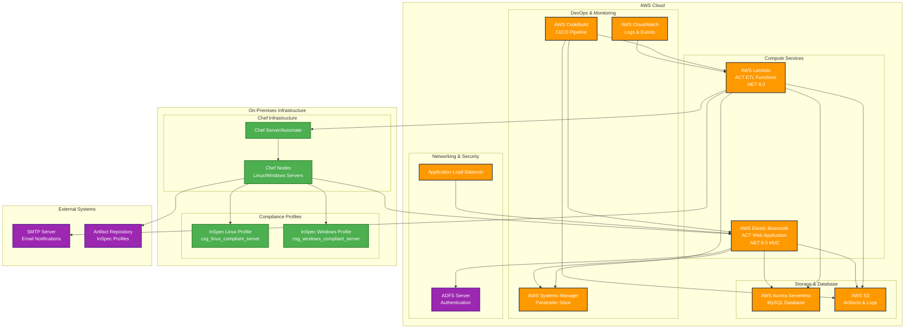
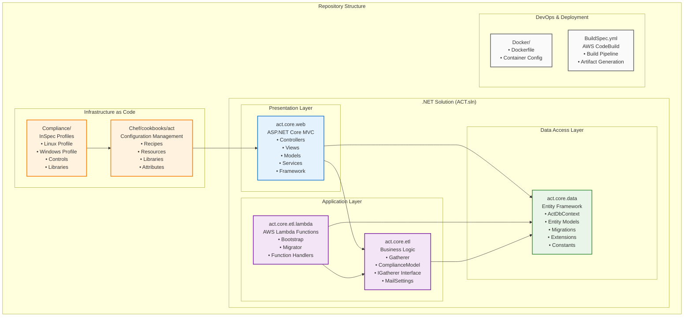
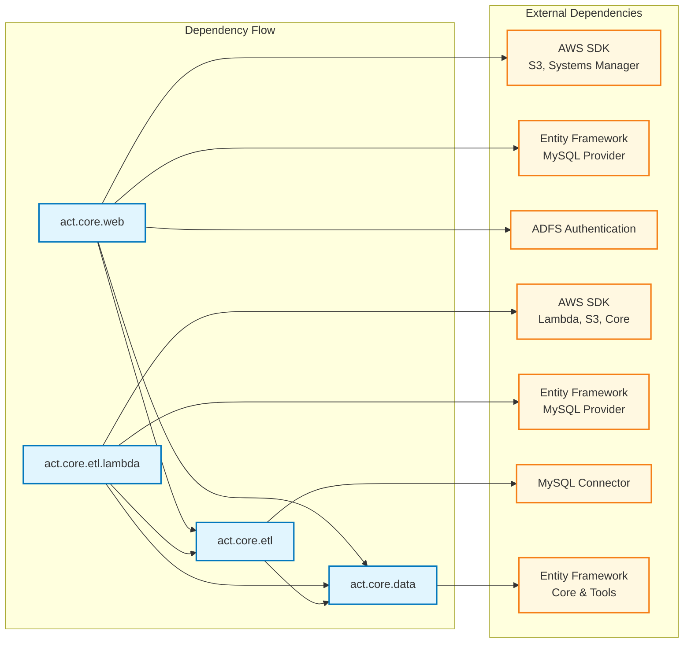
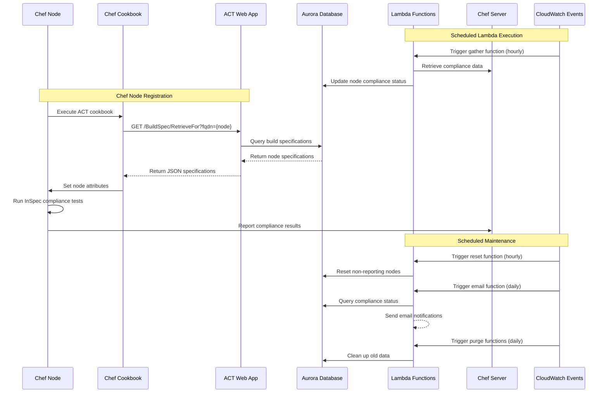

# ACT - Asset Compliance Tracker Architecture

## System Overview

ACT (Asset Compliance Tracker) is a hybrid on-premises/cloud PCI compliance monitoring solution designed to track and validate the compliance status of virtual machines and physical servers across multiple environments.

## Architecture Components

### Core Components

1. **ACT Web Application** (.NET 8.0 MVC)
   - Hosted on AWS Elastic Beanstalk
   - Provides web interface for compliance management
   - Handles user authentication via ADFS
   - Manages build specifications and compliance reports

2. **ACT Lambda Functions** (.NET 8.0)
   - Serverless data processing functions
   - Handles scheduled tasks via CloudWatch Events
   - Performs database operations and data gathering

3. **MySQL Database** (AWS Aurora Serverless)
   - Stores compliance specifications and node data
   - Entity Framework Code-First with migrations
   - Supports both QA and Production environments

4. **Chef Cookbook & InSpec Profiles**
   - Deploys compliance tests to target servers
   - Retrieves specifications from ACT web service
   - Executes compliance validation on Linux/Windows servers

## AWS Deployment Architecture

## Code Structure Architecture

The ACT solution follows a layered architecture pattern with clear separation of concerns across multiple .NET 8.0 projects:

### Project Dependencies

### Key Architectural Patterns

1. **Layered Architecture**
   - **Presentation**: MVC web application with controllers, views, and models
   - **Application**: Business logic and Lambda function handlers
   - **Data Access**: Entity Framework with database context and models

2. **Dependency Injection**
   - All projects use Microsoft.Extensions.DependencyInjection
   - Services registered in Bootstrap classes
   - Scoped lifetime for database contexts

3. **Configuration Management**
   - appsettings.json for application configuration
   - AWS Systems Manager for secure parameters
   - Environment-specific configuration files

4. **Entity Framework Code-First**
   - Database schema defined in C# entity classes
   - Migrations for database versioning
   - Repository pattern through DbContext

## Data Flow Architecture

## Component Interactions

### 1. Web Application Flow
- Users authenticate via ADFS Federation
- Create and manage build specifications
- Assign specifications to nodes
- View compliance dashboards and reports

### 2. Lambda Functions Flow
- **gather**: Retrieves data from Chef Automate servers
- **email**: Sends compliance notifications
- **reset**: Resets status of non-reporting nodes
- **purgedetails**: Cleans up compliance details
- **purgeruns**: Removes old compliance runs
- **purgeinactive**: Removes deactivated nodes

### 3. Chef Integration Flow
- Cookbook retrieves node specifications from ACT web service
- Sets attributes for InSpec compliance tests
- Executes platform-specific compliance validation
- Reports results back to Chef Automate

## Deployment Environments

### Production Environment
- **Web App**: Elastic Beanstalk Production environment
- **Database**: Aurora Serverless Production cluster
- **Lambda**: Production Lambda functions with CloudWatch scheduling

### QA Environment  
- **Web App**: Elastic Beanstalk QA environment
- **Database**: Aurora Serverless QA cluster
- **Lambda**: QA Lambda functions for testing

## Security Architecture

### Authentication & Authorization
- ADFS Federation for web application authentication
- AWS IAM roles for service-to-service communication
- Parameter Store for secure configuration management

### Network Security
- Application Load Balancer with SSL termination
- VPC with private subnets for database
- Security groups restricting access to necessary ports

### Data Security
- SSL/TLS encryption in transit
- Database encryption at rest
- Secure parameter storage for connection strings

## Scalability & High Availability

### Auto Scaling
- Elastic Beanstalk auto-scaling for web application
- Aurora Serverless automatic scaling for database
- Lambda automatic scaling based on demand

### High Availability
- Multi-AZ deployment for Elastic Beanstalk
- Aurora Serverless built-in high availability
- Lambda inherent fault tolerance

## Monitoring & Logging

### CloudWatch Integration
- Application logs from Elastic Beanstalk
- Lambda function execution logs
- Custom metrics for compliance tracking

### Alerting
- Email notifications for compliance issues
- CloudWatch alarms for system health
- Chef Automate reporting for node compliance